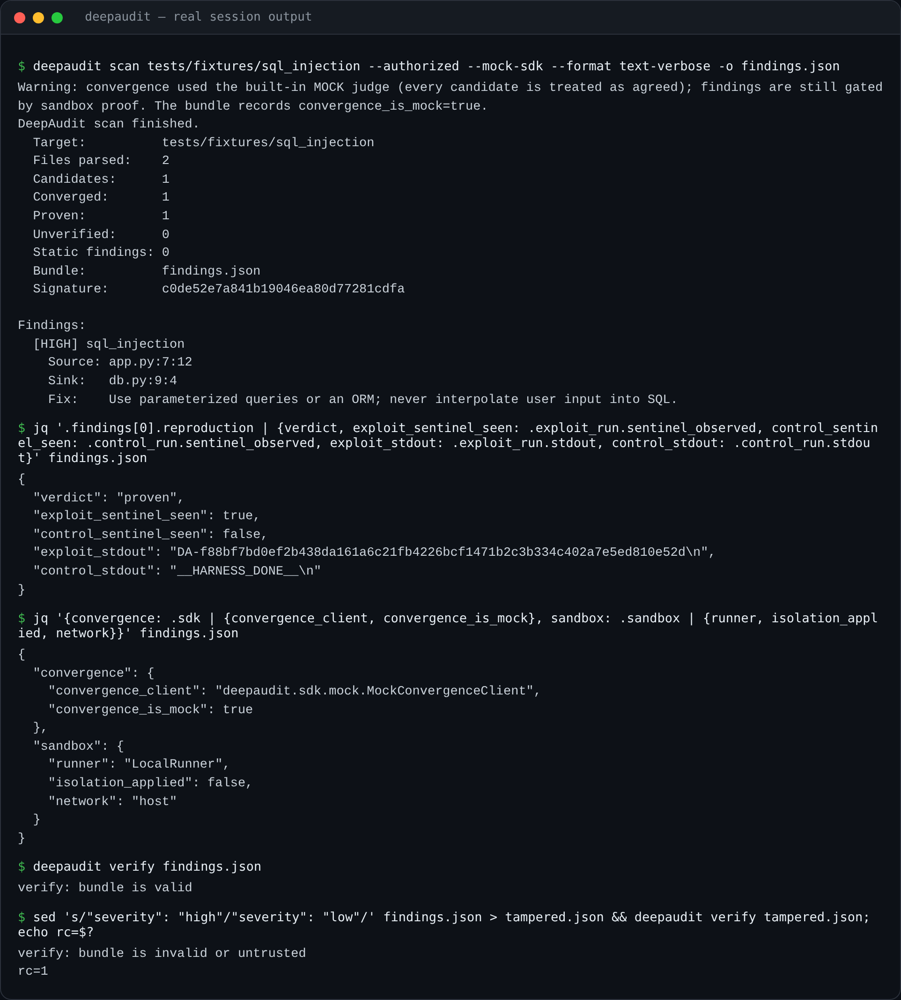

<div align="center">

# DeepAudit

**The security auditor that ships only what it can prove.**

Most scanners hand you a wall of "possible" vulnerabilities. DeepAudit reports one only after exploiting it next to a matched control run, and it signs the result. This app still needs some work. 




<sub>Real output from this repository, run with the built-in mock judge (`--mock-sdk`). The bundle says so itself: `convergence_is_mock: true`, and the sandbox block says the harnesses ran as host subprocesses. The last command edits one field of the signed bundle, and verification rejects it.</sub>

</div>

---

**The specification:** [`docs/specification/`](docs/specification/) holds the specification Sneferu built this from, copied word for word from its run record.

## Proof, not suspicion

Every shipped finding carries an **exploit/control differential**. A fresh random sentinel appears in the exploit run and is absent from the matched control run. If DeepAudit can't reproduce that difference, the candidate is labeled `UNVERIFIED` and kept out of the signed findings bundle.

This is a real finding from the bundled SQL-injection fixture: the source, the cross-file path to the sink, and the proof.

```text
exploit_class   sql_injection  (high)
source          app.py:7    request.args.get('q', '')             in app.handle_search
  → path        app.py:8    db.search_raw(query)
sink            db.py:9     cursor.execute(f"SELECT name FROM items WHERE name = '{query}'")

exploit run     sentinel_observed = True    stdout: DA-f88b…e52d
control run     sentinel_observed = False   stdout: __HARNESS_DONE__
verdict         proven
```

## How it works

```text
Stage 1        Stage 2              Stage 3          Stage 4
Repo map   →   Convergence      →   Proof exec   →   Bundle + sign
cross-file     each candidate       exploit vs       findings, traces,
call graph,    judged by Sneferu    control run;     reproduction PoCs,
data flow,     (POST /sdk/judge):   keep only        Ed25519 signature
trust          distinct model       sentinel         over RFC 8785
boundaries     lineages must agree  differentials    canonical JSON
   └─ static secret scan ──────────────────────────→ static findings
```

1. **Map** every Python file: a cross-file call graph, data-flow edges and trust-boundary tags.
2. **Enumerate** taint paths from untrusted sources to dangerous sinks.
3. **Converge**: each candidate goes to Sneferu's cross-lineage judge. Independently trained models have to agree it is genuinely exploitable before anything is attacked.
4. **Prove**: generate exploit and control harnesses from typed templates and run both.
5. **Sign**: emit a canonicalized JSON bundle signed with Ed25519, carrying findings, traces, reproduction artifacts, and a record of which judge and which sandbox actually ran.

Hardcoded secrets are found directly during mapping and skip the proof pipeline.

## Built on the Sneferu SDK

DeepAudit doesn't reimplement multi-model convergence. It calls Sneferu for it, through Sneferu's public Python SDK:

- **Engine in mock mode:** the scan reached `/sdk/judge`, and two mock lineages agreed. The finding was proven, and the bundle recorded `convergence_is_mock: true` and `engine_reported_mock: true`.
- **Engine live, with no model keys on that machine:** the engine answered degraded, so nothing converged and nothing was proven. The bundle recorded `engine_reported_degraded: true`.

**Not yet exercised:** a scan against Sneferu with live models behind the judge. The wiring, request shape, response handling and honesty labels are verified. The model verdicts themselves are not.

## Try it

```bash
python3.12 -m venv .venv && source .venv/bin/activate
pip install -e ".[dev]"

python3 -m pytest tests -q          # 39 passed

deepaudit scan tests/fixtures/sql_injection --authorized --mock-sdk
```

The `--authorized` flag is required: you confirm you own the code or have permission to test it (`DEEPAUDIT_AUTHORIZED=1` also works).

`--mock-sdk` swaps Sneferu's judge for a deterministic mock that accepts every candidate. That makes the proof layer runnable in CI with no engine. **The proof step is still real:** every finding below was exploited, and a matched control run stayed clean. Without `--mock-sdk`, DeepAudit uses Sneferu when it can reach it and falls back to the mock when it can't, and the bundle records which happened.

| Bundled fixture | Candidates | Proven | Proof template |
|---|:-:|:-:|---|
| `sql_injection` | 1 | 1 | `sql_injection_read` |
| `command_injection` | 1 | 1 | `command_injection_echo` |
| `code_injection` | 1 | 1 | `code_injection_exec` |
| `path_traversal` | 1 | 1 | `path_traversal_read` |
| `template_injection` | 1 | 1 | `template_injection_jinja2` |
| `unsafe_deserialization` | 1 | 1 | `unsafe_deserialization_pickle` |
| `auth_bypass` | 1 | 1 | `auth_bypass_direct` |
| `acceptance_repo` | 1 | 1 | `sql_injection_read` |

The negative paths are checked too. A rejecting judge (unit test) and a degraded Sneferu panel (the real-engine run above) both leave nothing proven and nothing shipped.

## Command line

```bash
deepaudit scan <repo> --authorized [options]
deepaudit verify <bundle> [--re-run <repo>]
```

| Flag | Meaning | Default |
|---|---|---|
| `-o, --output <path>` | signed bundle destination | `./deepaudit-findings.json` |
| `--format json\|text\|text-verbose\|sarif` | output format | `json` |
| `--severity <level>` | minimum severity to ship | `low` |
| `--sandbox-mode local\|docker` | where proofs execute (see Status) | `local` |
| `--scan-timeout <sec>` | per-harness wall clock | `60` |
| `--dry-run` | map and converge only | off |
| `--include-unverified` | keep diagnostics for unproven candidates | off |
| `--mock-sdk` | built-in mock judge instead of Sneferu | off |

`scan` exits `0` when it writes a bundle, including a bundle with zero proven findings, and `3` for invalid input or missing authorization. `verify` exits `0` for a valid bundle and `1` for an invalid or tampered one.

More detail: [`deepaudit/README.md`](deepaudit/README.md), the template catalog in [`deepaudit/docs/TEMPLATES.md`](deepaudit/docs/TEMPLATES.md), the specification in [`docs/specification/`](docs/specification/), and the build record (implementation notes, finalizer notes) in [`docs/build-record/`](docs/build-record/).

## Status, honestly

- **v1, Python targets.** The architecture is language-agnostic; Python is the first language adapter.
- **The proof sandbox is not a security boundary yet.** `local` mode runs each harness as a host subprocess with a scrubbed environment and a timeout, but with the host's network and no container. `docker` mode is a stub in v1, so every proof comes back `UNVERIFIED`. The bundle's `sandbox` block records exactly this. Run DeepAudit only on code you trust.
- **Live-model convergence is unexercised**, as described above.
- **No pricing, accounts or telemetry:** this is the working engine.


## How it was made

DeepAudit was specified as *a sellable developer security tool built on the Sneferu SDK*. Sneferu code run `2026-06-25T13-12-07Z-code-07c0ebd5` built this v1 engine from a revision-5 root specification, in cooperative rounds between independent coder and reviewer models. 

<div align="center">

---

**Built by [Sneferu](https://sneferu.ai)**

<sub>README by Claude (Anthropic).</sub>

</div>
